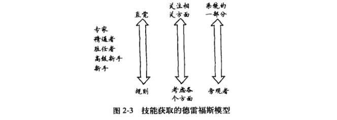
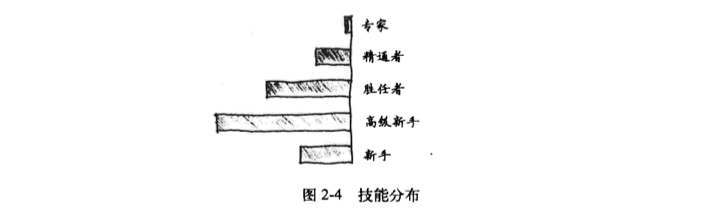

# 程序员的思维修炼
* 作者: Andy Hunt(著) 崔康(译)

## 第1章: 绪论

> 软件是在头脑中创建的(Software is created in your head)。

Frederick Brooks 知名文章《没有银弹》提出: 软件产品处于应用、用户、规则和硬件的合力之下。这些因素总是在不断变化，迫使软件也随之改变。

最重要的2项技能:
* 沟通能力
* 学习和思考能力

### 1.1 实用
> 切忌随波逐流(Only dead fish go with the flow)。

实用主义的本质: 做对你有用的事情。

`原则`: 如果某种方法是有效的，那么它就是实用的。

### 1.2 关注情景
> 一切都是相互关联的(Everything is interconnected)。

当我们试图将某个事务单独挑出来时，我们发现它与宇宙中的其他事物是息息相关的。 --约翰·缪尔 (美国作家) 1911年 《山间夏日》

**诀窍1: 始终关注情景。**

### 1.3 所有人都关注这些技能

> 有些东西是基础的、各领域相通的(There's something fundamental here)。

### 1.4 本书结构
* 1.从新手到专家的历程
* 2.认识你的🧠
* 3.正确使用🧠
* 4.调试你的🧠
* 5.积极学习
* 6.积累经验
* 7.控制注意力
* 8.超越专家
* 9.实践单元

## 第2章: 从新手到专家的历程

> 制造问题的思维方式无法用来解决问题。--阿尔伯特·爱因斯坦

理论分为2种:
* 事件理论: 可以被测量、验证、证明
* 构建理论: 无形的抽象，无法被证明

构建理论是通过它的用处来衡量的。无法判断某个构建理论准确与否，是客观存在和抽象的结合体。

如，无法证明人有思维，事实上没有这种客观事务，只是一种概念。

### 德雷福斯技能获取模型

德雷福斯模型: 构建理论

## 2.1 新手与专家
> 清晰表达专业技能十分困难(It's hard to articulate expertise)。

## 2.2 德雷福斯模型的5个阶段
德雷福斯模型针对每项技能(Dreyfus is applicable per skill)。

### 阶段1: 新手
> 新手需要指令清单(Novices need recipes)。

#### 概念

新手: 只该技能领域经验很少或者根本没有经验。

`经验`: 通过实施这项技术促进了思维的改变。

#### 问题

指令清单(包含情景无关的规则)的问题: 你不能一五一十将所有事情解释清楚。

> 规则只能让你启程，不会让你走得更远。

### 阶段2: 高级新手
> 高级新手不想要全局思维(Advanced beginners don't want the big picture)。

#### 概念

高级新手能够开始多多少少地摆脱固定规则，可以独自尝试任务，但仍难以解决问题。

高级新手能够根据过去经验，逐步在正确的情景中采纳建议，但比较吃力。同时，能够开始形成一些总体原则，但不是 全貌。

### 阶段3: 胜任者
> 胜任者能够解决问题(Competents can troubleshot)。

#### 概念

从业者现在能够建立问题域的概念模型，并有效使用它们。

胜任者可以独立解决自己遇到的问题，并开始考虑如何解决新问题--那些他们之前没有遇到的问题。

他们开始寻求和运用专家的意见，并有效利用。

胜任者会探寻和解决问题，他们工作更多是基于谨慎的计划和过去的经验。

处于这一水平的人，通常被认为具有“主动性”和“足智多谋”。往往在团队中发挥领导作用。他们可以是团队里的好人，既可以指导新手，也不会经常骚扰专家。

#### 问题

即使在这一水平，人们无法按照我们希望的方式来应用敏捷方法--大家还没有足够的能力反思和自我纠正。
  
为此，我们需要获得突破，达到新的水平: 精通

### 阶段4: 精通者
> 精通者能够自我纠正(Proficient practitioners can self-correct)。

#### 概念

精通水平的从业者需要全局思维。他们将围绕这个技术，寻找并了解更大的概念框架。

对于过于简单化的信息，他们会非常沮丧。

#### 突破

处于精通的从业人员有一项重大突破: 他们能够纠正以往不好的工作表现。

(会反思之前是如何做的，并修改其做法，期望下一次变得更好。到这个阶段，自我改进才会出现。)

会学习他人的经验。作为精通者，能够阅读案例研究，倾听有关失败项目的流言蜚语，观察别人怎么做，从故事中认真学习，即使没有亲自参与。

#### 运用软件模式

处于精通水平的人，可以有效利用软件模式(设计模式)，但是这不是较低水平所必须掌握的。

### 阶段5: 专家
> 专家凭直觉工作(Experts work from intuition)。

#### 概念
专家是各个领域知识和信息的主要来源。

他们总是不断寻找更好的方法和方式去做事。

他们有丰富的经验，可以在恰当的情境中选取和应用这些经验。

根据统计，专家的数量很少，大概占总人数的 1% ~ 5%。

#### 专家凭直觉工作
专家凭直觉工作，这不需要理由。

* 到底什么是直觉？(本书后面会阐述)

## 2.3 现实中德雷福斯模型: 赛马 和 赛羊

**诀窍2: 新手使用规则，专家使用直觉。**

从新手到专家，最重要3个变化如下:
* 1.从依赖规则 向 依赖直觉转变
* 2.观念的转变，问题已不再是一个相关度等同的所有单元的集合体，而是一个完整和独特的整体，其中只是某些单元是相关的
* 3.从问题的旁观者 转变为 问题涉及的系统本身的一部分

脱离独立 和 绝对化的规则，进入直觉的境界。

> 大多数人都是高级新手(Most people are advanced beginners)。

研究表明，大多数人的大多数技能，在大多数时间里，从来没有高于第二阶段的高级新手(Sad!)。

**执行他们需要做的的任务并根据需求学习新任务，但是从来没有对任务环境获得更广泛、概念上的理解。**

> 此外，研究表明，元认知能力，或者自我认知能力，往往在较高的技能层级中才会具有。
> 
> 意味着，较低技能层级的从业者会明显高估自己的能力，有研究表明，高出 50%。

**正确自我评估方法: 提高个人技能层次，反过来又会提高元认知能力。**

**诀窍3: 知道你不知道什么。**

> 直觉和匹配模式能力超载了显性知识(Intuition and pattern matching replace explicit knowledge)。

### 积极的实践

积极的实践需要4个条件:
* 1.需要1个明确定义的任务
* 2.任务需要有适当难度--有挑战性但可行
* 3.任务环境可以提供大量反馈，以便于你采取行动
* 4.提供重复犯错和纠正错误的机会

## 2.4 勇于承担责任

> “我只是执行命令！”是无用的(“I was just following orders!” doesn't work.)。

**诀窍4: 通过观察和模仿学习。**

学习音乐经历的三个阶段:
* 模仿
* 吸收
* 创新

### 在实践中保持技能

> 优胜者不会帮扶失败者(Winners don't carry losers)。

对组织来说，设置1个能反映最优秀程序员价值的薪酬等级和职业阶梯是实现这个目标的第1步。

**诀窍5: 保持实践以维持专家水平。**

### 警惕工具陷阱

> 模型是工具，而非镜子(The model is a tool, not a mirror)。

**诀窍6: 如果你需要创造力、直觉或独创能力，避免使用形式化方法。**

> 警惕非情景化的客观性(Beware decontextualized objectivity)。

**诀窍7: 学习如何学习的技能。**

## 第3章: 认识你的大脑